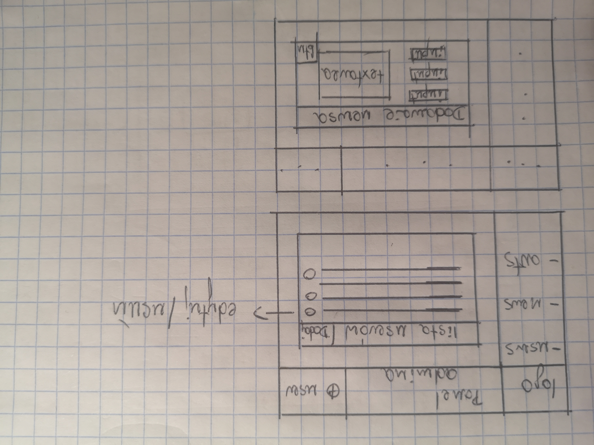

## Panel Administracyjny

    isAuthenticated: true + role: 'ADMIN'

### 1. Użytkownicy

-   [x] Lista

-   [x] Dodaj

-   [x] Edytuj

-   [x] Usuń

### 2. Newsy

-   [x] Lista -> **tabela**

    ```

    ```

-   [x] Nowy -> **formularz**

        			 {
        				kategoria (select/input+autoc.),
        				tytuł (input tekstowy),
        				treść (textarea),
        				autor (zalogowany user),
        				data (DatePicker),
        				potwierdź (button)
        			}  => store => fetch(POST) => controller => MongoDB


-   [x] Edytuj

-   [x] Usuń

### Artykuły

-   [x] Lista,

-   [x] Dodaj,

-   [x] Edytuj,

-   [x] Usuń.

{ width=50% }
