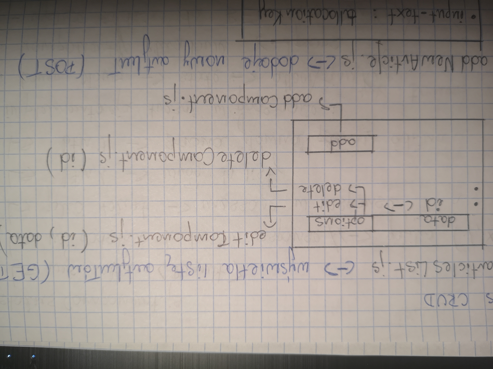
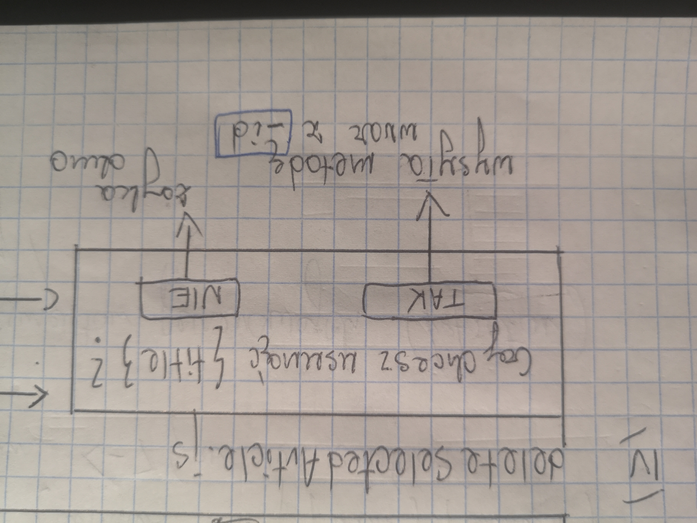

## ARTICLES CRUD
I. **articlesList**.js <-> wyświetla listę artykułów (`GET`).
- data
- options (`id`) - **dropdown**
	- editComponent.js (`id`, `data`),
	- deleteComponent.js (`id`),
- addComponent.js - **button**

	

II. **addNewArticle**.js <-> dodaje nowy artykuł (`POST`).

 - input-text: `allokationKey`,
 - input-text: `title`,
 - input-textarea: `content`,
 - input-text: `author` (default/autocomplete <-> **users**),
 - datePicker: `date`,
 - button-confirm.

III. **editSelectedArticle**.js <-> modyfikuje istniejący artykuł (`PATCH`).

- rozpoznawanie artykułu po `_id`,
- dosyłane do komponentu dane aktualne z bazy jako `default` (uzupełniające pola formularza wejściowo po jego otwarciu)
- schemat j.w., ale:
 	 - bez datePicker,
	 - w żadaniu wysyłane: `{ lastModified: new Date() }`.

IV. **deleteSelectedArticle**.js <-> usuwa wybrany artykuł (`DELETE`).

`Czy chcesz usunąć {title}?`

- forma preferowana: okienko przysłaniające listę (**popup**),
- rozpoznawanie artykułu po `_id`,
- wybór odpowiedzi `TAK` wysyła metodę wraz z `_id`,
- wybór odpowiedzi `NIE` zamyka okno.

	

V. **statusComponent**.js

- wyświetla `<Result>`,
- na podstawie `kodu` w response <-> grafika (**sukces**, **błąd**, **problem**),
- jako tekst - `message` w response,
- btn1 -> wróć do listy,
- btn2 -> strona główna panelu admina.

VI. Implementacja treści w podstronie:

 1. Komponent główny -> **state** => `allocationKey` => **props**,
 2. Komponenty składowe <= **props**
	 
	 - wysłanie żądania do backendu (`allokationKey`),
	 - zwrotka - dane artykułu,
	 - **header** <-> `{title}`,
	 - **content** <-> `{content}` <-> **react-html-parser**,
	 - **autor** <-> `{author}` + **data utworzenia** <-> `{date}`,
	 - **breadcrumb** <-> `{title}` <-> **navigationTitles(props)**.

3. Ogólna struktura komponentu podstrony.
	
		Kompontenty globalne (Header, Footer, Sidebar)
			Layout (wrapper)
				Breadcrumb
				Content
				PageHeader <-> {articles.title} {date} {author}
				komponent z zawartością <-> {articles.content}
				Table
					komponenty fragmentów generowanych
				
				// sekcja komentarzy //
	