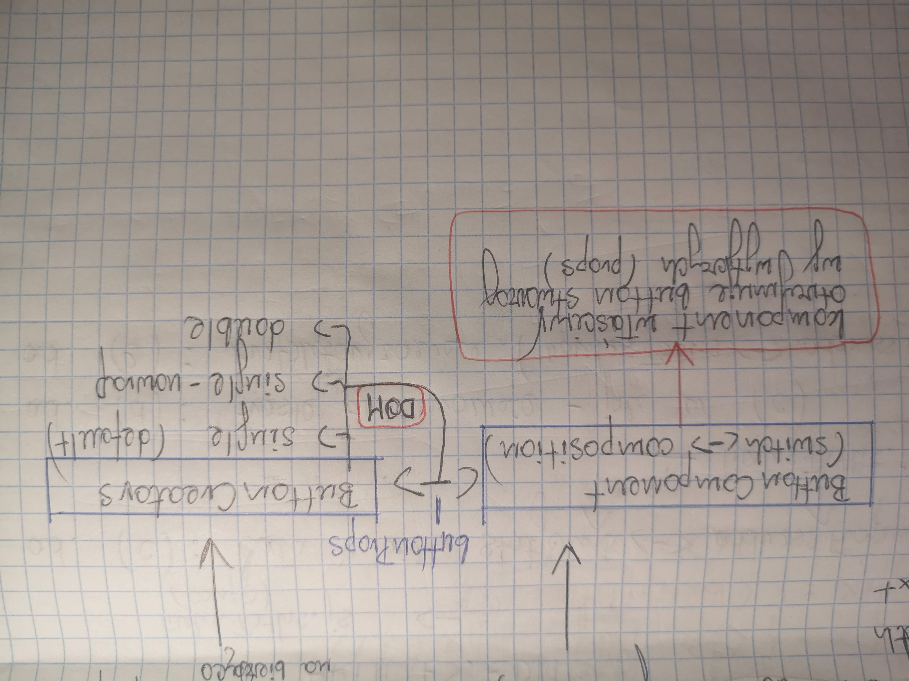

## Przyciski w projekcie

1. Wersje podstawowe (zapakowane w .btn-wrap):
	- pojedynczy button,
	- dwa buttony:	
			- button główny,
			- divider,
			- button dodatkowy (Link <=> rezygnacja z akcji).
2. Propsy buttona głównego:
	- icon,
	- type,
	- htmlType,
	- text.
3. Propsy buttona dodatkowego (obecnie):
	- path,
	- text.

			ButtonComponent (switch <=> composition) 
			=> (buttonProps) => ButtonCreators 
											- single (default)
											- single-nowrap
											- double
			=> (DOM) => komponent właściwy 
			otrzymuje button stworzony wg wytycznych (props)
			
	
4. Postępowanie przy developmencie:
	- stworzyć komponent,
	- zaimplementować,
	- rozważyć rozszerzanie alternatyw lub props na bieżąco.

	
