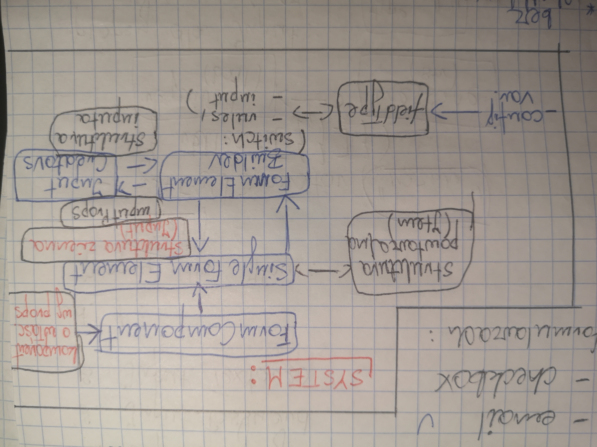

## Funkcje pojedynczych pól formularza

### I. Typy pól:
	
1. Input (zwykły).
2. Input.Password.
3. Input.Textarea.

		a) propsy dla Item:
			- label
			- getFieldDecorator("nazwa", {
				rules: [{
					required: Boolean,
					message: String
					}]
				})
		
		b) propsy dla Input
			- prefix = {<Icon type="" style={} />}
			- suffix = {
				<Tooltip title=""> 
					<Icon type="info-circle" style={} />
				</ Tooltip>
				}	
			- placeholder = ""

Pozyskiwanie danych:
		
		a) z komponentu nadrzędnego:
			- label,
			- fieldName,
			- required,
			- message,
			- icon,
			- tooltip,
			- placeholder;
		b) ze style.js -> style;
		c) pozostałe elementy -> struktura komponentu.

### II. Development.

 1. Utworzenie komponentu zwykłego inputa.
 2. Dodanie wersji dla:
		
	 - [X] textarea,
	 - [X] select,
	 - [X] datepicker,
	 - [X] email,
	 - [X] password,
	 - [X] checkbox.

3. Implementacja w formularzach:

	- [X] ArticlesAdd,
	- [X] ArticlesEdit,
	- [X] NewsAdd,
	- [X] NewsEdit,
	- [X] UsersAdd,
	- [X] UsersEdit,
	- [X] UserProfile,
	- [X] Login,
	- [X] Register.

4. SYSTEM.

	

5. Przebudowa SingleFormElement pod kątem racjonalizacji kodu:

		<Item ... > // warstwa powtarzalna
			{getField(name, {
				rules: [ ],
				initial: ''
				})
				(<Input />) // FormElement(switch)
			}
		</Item>
		
		rules: [
			{ required, message }, <=> common
			{ type: 'object' }, <=> date
			{ min }, { pattern}, {validator} <=> password
			]
	
		- SingleFormElement =(props)=> FormElementBuilder =(inputProps)=> InputCreators
		- InputCreators =(Input)=> FormElementBuilder =(Input, rules)=> SingleFormElement => (Item, decorator, Input)
		
	
