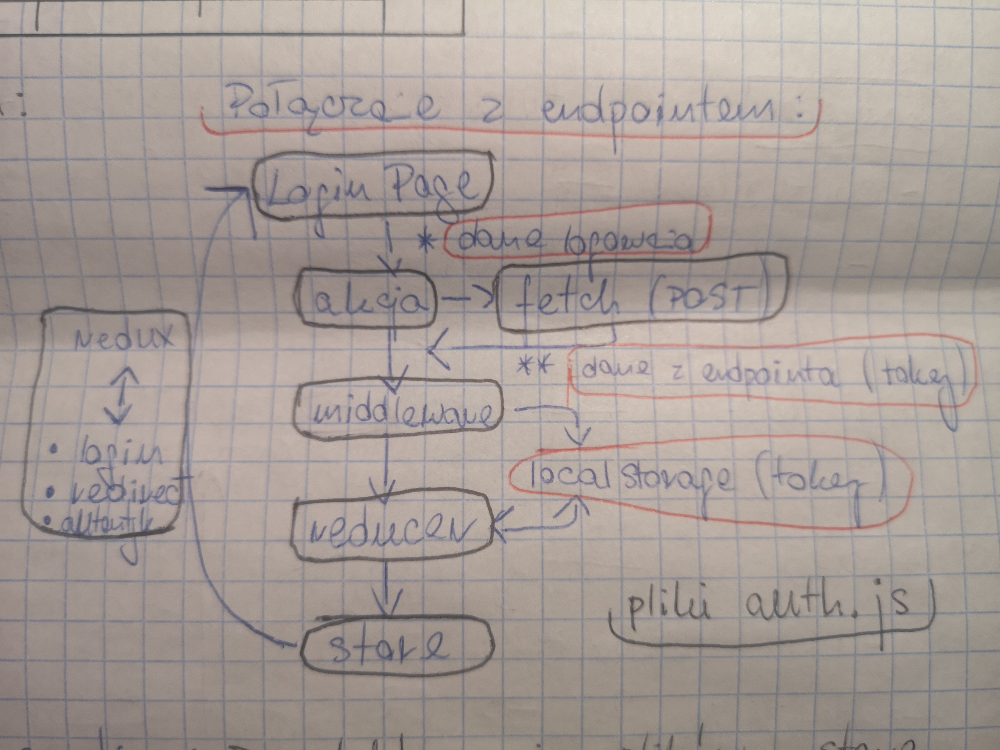

## Logowanie (LoginPage)

1. Struktura podstawowa. 

	

    - wpisane dane => state => store
    
    - błędne logowanie => error z backendu

    - poprawne logowanie => localStorage

2. Komponenty AntDesign

    - Form

    - Icon

    - Input

    - Button

    - Checkbox

3. Połączenie z endpointem.

	

4. Dane logowania:

    - `username` LUB `email` => endpoint => **tokens** => `access`, `refresh`
                                            **tokens** => frontend (**localStorage**)

    - `password` => j.w.

    - `rememberMe` => **store/localstorage**

5. Dane rejestracji:

    - `username`

    - `email`

    - `password`

    - plus ew. pola nieobowiązkowe

    => endpoind => **MongoDB**

6. Autoryzacja logowania:

    - endpoint: `/api/login`,

    - POST: `{ email, password }`,

    - res: `{ accessToken, refreshToken }`.
