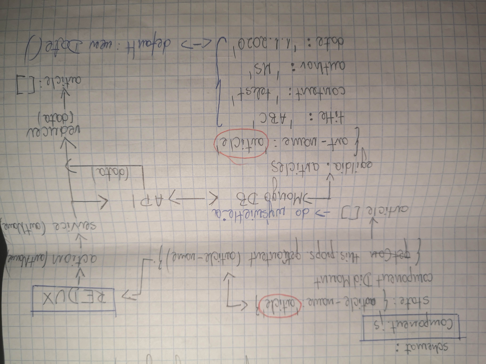

## Zarządzanie tekstami na stronie.

Dwa główne typy tekstów:
I. **articles** - content podstron statycznych.
II. **news** - aktualności (strona główna).

ad. I

 - każdy artykuł będzie posiadał unikalną nazwę,
 - komponenty podstron wyślą stringa z żądaną nazwą,
 - backend zwróci (`GET`) właściwy artykuł po nazwie

schemat:
**Component.js**

		state: { 
			article-name: article
		}
			
		componentDidMount { 
			this.props.getConent(article-name)
		}
			=> REDUX => action(artName) => service (artName) 
				=> reducer (data) => article: []
				<=(data)=> API <=> MongoDB
					egildia.articles {
						art-name: 'article',
						title: 'ABC',
						content: 'tekst',
						author: 'MS',
						date: '1.1.2020' <=> default: new Date()
					}

ad. II

- nowości wyświetlane będą na stronie głównej, od najnowszego do najstarszego,
- przybliżona struktura:
		
		<article key={_id}>
		<h2> {title} </h2> // header
		<section class="meta"> // meta section
			
 
				 {date} 
				 {author} 
			

		<section class="content"> // content section
			

					{content}
			

		</article>
		
		* oznaczenie kategorii (tekst lub obrazek)
		** sekcja komentarzy dostępna po rozwinięciu

- MongoDB:
		
		{
			title: 'ABC',
			content: 'tekst',
			date: '1.10.2019',
			author: 'MS',
			category: 'Inne'
		}

	

	- oznaczenie kategorii (aktualnie avatar),
	- akcje widoczne tylko gdy `user.role='admin'`
			- edytuj,
			- usuń,
	- przycisk **dalej** widoczny, gdy news.content.length > 100 (znaków); po kliknięciu otwiera stronę newsa z komentarzami,
	- treść artykułu widoczna bezpośrednio na stronie głównej - max 100 znaków,
	- licznik komentarzy.	
